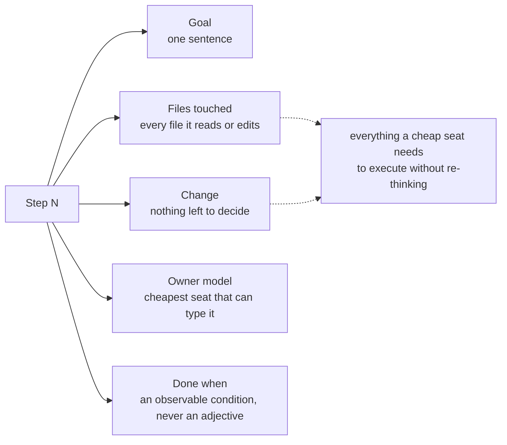

# 05 · Write a plan

"Verify the webhook signature before processing" is not a task. It's a finding.

Buried in it are a dozen small decisions: which library, where the secret lives, what happens to a request that fails, whether to log it, how not to break the three tests that currently pass by accident. Hand that finding straight to a cheap model and the cheap model makes every one of those decisions by guessing.

So the architect makes them first, and writes them down completely enough that a Sonnet or a Codex can execute any single step without a judgment call of its own. Five fields per step. No exceptions.



"Done when: the webhook is secure" is not a done-condition. It's a wish. *The forged POST returns 401* is a done-condition.

## Check it by machine, then by model

```bash
claude --model fable --effort high "Read audit.md. Write plan.md that fixes the P0
and P1 findings. Five fields per step. Order the steps so nothing depends on a
later one." > plan.md

bash plan-check.sh plan.md
```

`plan-check.sh` wants a field count that's a clean multiple of five with every label at equal count, and no vague Change lines. A label that comes up short is the field a step dropped, which is the field a cheap seat will be forced to guess at.

That's a spot-check, not a proof. The real test costs eleven cents:

```bash
claude --model sonnet "Execute exactly this step and nothing more:
$(sed -n '/## Step 1/,/## Step 2/p' plan.md)"
```

If Sonnet does it with no questions, the step is specified. If it asks *"which hashing algorithm?"*, that question is a judgment your plan failed to make. Go make it.

The bar for the whole file is one sentence: **could a cheap seat execute any single step with zero additional judgment?** Test it on the step you trust least, not the one you're proud of.
