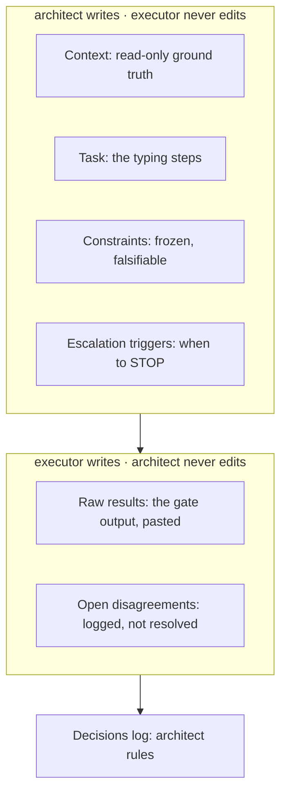

# 06 · The handoff contract

Two weeks from now the cheapest good executor might be Codex instead of Sonnet. Six months from now it'll be something that doesn't exist yet. If your workflow depends on a *model*, every one of those is a migration. If it depends on a *file*, they're a shrug.

Four things have to cross the seam or the executor invents them: the context it must not change, the task, the constraints that must hold, and the conditions under which it stops and hands back. Miss one and you've left a gap for a guess.



Lint it before you hand it over, so the executor doesn't find the gaps for you:

```bash
node contract-lint.js ../../worked-examples/handoff.md
```

Delete the Escalation section or blank the Threshold column and those rows flip to `GAP` and get counted. Every gap you leave is one the executor fills with a guess.

It checks **structure only**. A vague constraint ("follow best practices") and a Context section bloated with the whole repo will both lint perfectly clean. Those still need your eyes. A contract that passes the linter can still be a bad contract.

## The proof

Take one step from your plan, write the contract, and hand the identical file to two different executors:

```bash
claude --model sonnet "$(cat handoff.md)"
codex exec "$(cat handoff.md)"      # or: claude --model haiku
```

They will write different code. That trips people up, and it shouldn't: you contracted on the **gate**, not on the code. The unit test passes, the forged POST gets a 401. Any implementation that clears the gate is acceptable and the exact lines don't matter. Specify the outcome and let a capable executor reach it however it reaches it. Specify the lines and you've done the typing yourself and paid a model to transcribe it.
