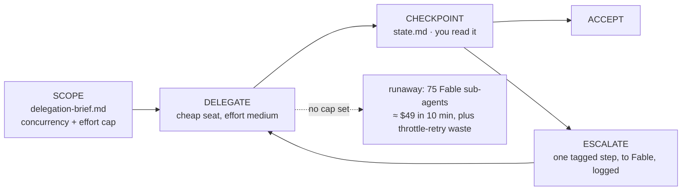

# 07 · Delegate the run

Seventy-five sub-agents. Ten minutes. Three percent of a five-hour limit, gone.

The model did nothing malicious. It did something *helpful*, at frontier prices, seventy-five times, in parallel, before the person watching could react. This is the highest-variance cost event in the whole workflow, and the file that prevents it is a delegation brief: the executor's task and its limits, in the same breath.



Price the thing you're preventing, with your own numbers:

```bash
python3 ../03-estimate-a-task/estimate.py --model fable-5 --input 40000 --output 5000
```

That's **one** fanned-out agent orienting itself. Multiply by seventy-five. Then run the pass under a brief:

```bash
claude --model sonnet --effort medium "$(cat delegation-brief.md)"
```

It should read only the files the brief names, make the change, run the gate, and stop. Nothing else. `state.md` carries what's done and what the gate said, so the run survives a compaction, a `/clear`, or a fresh executor picking it up cold.

Two caps do all the work. **Concurrency**: serial, no sub-agents, unless the lanes touch genuinely disjoint files. **Effort**: medium, because typing has nothing left to deliberate about. Running an executor at high effort is paying for deliberation on work where every decision was already made.

## The only lever that actually stops a runaway

Discouraging one is not stopping one. This kills the run:

```bash
claude -p --max-budget-usd 5 --output-format json "$(cat delegation-brief.md)" > run.json
```

Then read what it cost. If you can't say what the run cost, you didn't finish the run. Keep `run.json`: it's a real trace, and it's the input to the detector in Chapter 9 and the ledger in Chapter 11.
