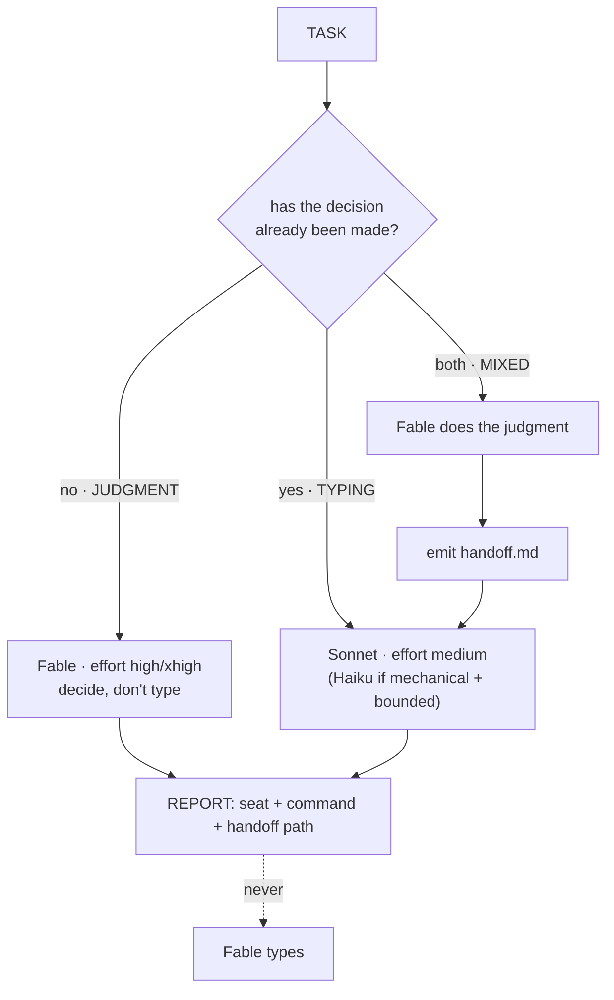

# 10 · /architect, the router

For nine chapters you were the router. Every task, you asked yourself the same question, and hand-picked the seat. That works right up until you're tired or rushed, and then you reflexively throw it all at Fable and pay the four-dollar tax.

The layer that would do it for you genuinely does not exist. Claude Code ships no per-task auto-router: `--model` is one manual choice per session, and nothing looks at your task and picks the seat. The community keeps asking. What ships is `opusplan`, which is the right shape with the wrong seat doing the planning.

So you own it instead of waiting for it.

## What it actually is

A skill in Claude Code is a plain file with a bit of YAML on top. There is no compiler, no plugin API, no registration. `/architect` is [one markdown file](../../skill/architect/SKILL.md) describing a procedure, and the harness follows it.

Be precise about what that means:

**It is an instruction file that Claude Code interprets.** It is not a local routing engine. It does not switch the active model for you. It does not run the cheap-seat command, and Step 4 exists specifically to stop it from helpfully barrelling on and typing everything at frontier rates. Nothing in this repo tests its *judgment*, and nothing could: what's tested is its structure, and the deterministic tools around it.

## It's already installed

`./install.sh` at the repo root put it in `~/.claude/skills/`, which means `/architect` works in **every project on this machine**. Routing logic is universal. The judgment-versus-typing question doesn't change from repo to repo, so the router doesn't belong to one.



That one question at the top is the whole classifier. *Has the decision already been made?* If yes, the task is typing no matter how technical it looks. If you can't tell, it's judgment, because uncertainty means a decision hasn't been made yet.

## Three shapes, three answers

A router you haven't tested on the hard case is a router you don't trust. Run these from inside `demo/invoicing-api`:

```
/architect audit the payments module for security issues
/architect rename amt to amountCents across billing
/architect the reconciliation job double-charges intermittently; find the cause and fix it
```

```
audit the payments module      → JUDGMENT  Fable 5 (xhigh)      no handoff
rename amt to amountCents      → TYPING    Haiku 4.5            no handoff
double-charge: find + fix      → MIXED     Fable then Sonnet    handoff written
```

Only the third writes a handoff. It should diagnose the real bug (a retry with no idempotency key in `src/jobs/reconcile.ts`), write the fix into a contract, and then **stop**, handing you a Sonnet command. If it typed the fix itself on Fable, the router is broken and you should read Step 4 again.

Verify which seat actually served it with the Chapter 9 detector. A silent Opus fallback would make the router's answer a lie.

## Three ways to make it better

None of these are required to ship it. Each one compounds.

- **Cost pre-flight.** Price the task on the assigned seat before emitting the command, with `../03-estimate-a-task/estimate.py`. A route that comes back surprisingly expensive is usually a misrouted judgment task, or one that's over-scoped.
- **Fallback check.** After any Fable step, confirm Fable served it (`../09-fallback/fallback.py`). A router that assigns Fable and silently gets Opus is routing on a lie.
- **Route log.** Append one line per decision to `docs/routes.log`. After a week you can finally see the routing you've been doing on instinct, and correct it with data instead of vibes.
