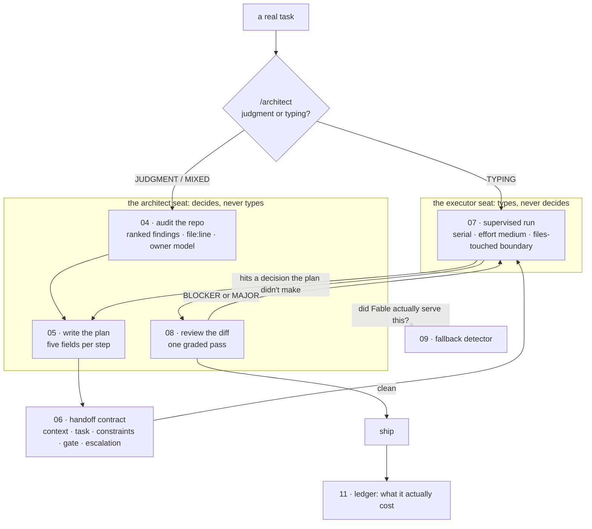

# The loop, in one diagram

The architect has exactly three jobs: **audit**, **plan**, **review**. Judgment at
the ends, cheap hands in the middle. There is no fourth Fable job, and in
particular there is no "Fable does the work" job.

Read the token *shape*, because it's why this is cheap. The architect's three jobs
are all input-heavy and output-light: it **reads** a lot of code and **writes** short
reports. That's the cheap direction — you're mostly paying the input rate to let the
best brain read. The one output-heavy step, the implementation, runs on the cheap
seat. Every place a lot of tokens get written, a cheap seat writes them.

## Why every piece is a file

Not one core artifact lives in a chat session, a product feature, or a model's
memory. Files survive the model getting pulled and the harness compacting your
conversation into a lossy summary. The chat is
where work happens; the files are what you keep.

Which is also why every artifact here names a **seat**, never a model. Fable fills
the architect socket today. The chips change; the sockets hold.
